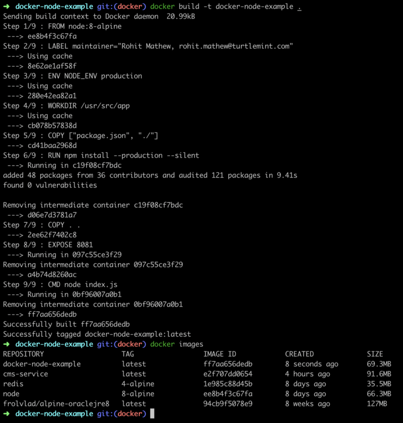

 on [Unsplash](https://unsplash.com/photos/uBe2mknURG4?utm_source=unsplash&utm_medium=referral&utm_content=creditCopyText)](./asset-1.jpeg)

There has been a conscious move within SaaS companies towards microservice architectures. To facilitate that, we generally use Docker setups. Well, let us not skip steps and see why people recommend this.

To better understand containerization and [Docker](https://hackernoon.com/tagged/docker), let’ use the example of the actual thing it is modeled after, Shipping Containers.

### Why use Shipping Containers?

Well, shipping containers revolutionized the transportation industry by standardizing and making it simple to transport large quantities of goods. This could be over sea or land. Now with these standard containers, we are able to ship multiple things in one container or even ship large quantities of a single thing in multiple containers. Some of the key features here are:

-   **Standardized:** These shipping containers were standardized and could all be shipped and moved across multiple continents and countries in the same manner regardless of what they contain or how they are transported.
-   **Handling:** These shipping containers are standardized and hence could be handled in the same manner regardless of what’s in them or where they are.
-   **Security:** These shipping containers are independent and separate from each other hence providing a barrier from external interference for the contents within.
-   **Scalable:** These shipping containers can fit multiple things within or fit large quantities of a single thing. We can also get more containers based on the number of goods.

### How does this work in Software Containerization?

Software Containerization works similarly as above. I’ll get into a little more detail later but we are able to achieve all the key features above in the following manner:

-   **Standardized:** The container we build for our code is running independently of our local system. Therefore, we can easily run the same code on our personal laptops to production servers/cloud server while expecting them to have the same experience everywhere. We have hence standardized how we expect our code to behave in all our environments and removed the “works on my system” problem.
-   **Handling:** These containers are standardized and hence we can easily deploy them as well as scale them when required. The scaling and management of these are handled by orchestration tools like Kubernetes or Docker Compose. Also, Docker can easily do anything on these containers due to a standard defined documents called Dockerfile.
-   **Security:** These containers are immutable and thus any change produces a new container which provides a secure setup of code. The code is within the container and also harder to access and manipulate.
-   **Scalable:** These containers can easily be scaled up or down based on criteria we have assigned for it. This is basically what an orchestration tool like Kubernetes or Docker Compose does. It is essentially able to spin up or shut down containers and handle the load on all of them.

### How Does Containerization Work?

To explain this simply, I will use the shipping container example again. Each container we have has a **_manifest_** file which basically specifies the contents of the container, how to load and unload it etc. The **_container_**  gets loaded based on the instructions of the manifest file and then the **_dock workers_** load/unload them based on instructions.

In the same way, we use two tools to do the above process with our code: Docker and Kubernetes. [Docker](https://www.docker.com/why-docker) is one of the most popular, open-source container technologies that allows you to build, run, test, and deploy distributed applications.

](./asset-2.png)

-   **Dockerfile:** This file is similar to the manifest file in a shipping container. This file contains all the details of how our container will be made, what all have to go inside it and how to run it.
-   **Docker Image:** This basically is sort of like an executable file of your code which when started will be run inside a container. This is a standard file and hence we are able to get the same execution on multiple instances (laptops/servers).
-   **Docker Container:** When we run a docker image we can have multiple images running inside one container or a single image. The idea of a container is slightly complex and I suggest you refer to the below brilliant article by [Preethi Kasireddy](https://medium.com/u/d446dafbe292) in [freeCodeCamp](https://medium.com/u/8b318225c16a)

[**A Beginner-Friendly Introduction to Containers, VMs and Docker**  
_If you’re a programmer or techie, chances are you’ve at least heard of Docker: a helpful tool for packing, shipping…_medium.freecodecamp.org](https://medium.freecodecamp.org/a-beginner-friendly-introduction-to-containers-vms-and-docker-79a9e3e119b "https://medium.freecodecamp.org/a-beginner-friendly-introduction-to-containers-vms-and-docker-79a9e3e119b")[](https://medium.freecodecamp.org/a-beginner-friendly-introduction-to-containers-vms-and-docker-79a9e3e119b)

Great now you know a bit of the basic theory behind Docker and Containerization, let's dive into some code

---

### Set up A Node.js Project

So I’m going to basically use an Express application that has a single API endpoint which I will test on the browser. I am not going to go into the details of the Express application but you can read through the README if you need help setting up the application and starting it.

[**rohitjmathew/docker-node-example**  
_An Express Application to Display how to Dockerize any node Application - rohitjmathew/docker-node-example_github.com](https://github.com/rohitjmathew/docker-node-example "https://github.com/rohitjmathew/docker-node-example")[](https://github.com/rohitjmathew/docker-node-example)

### Set up Docker

We will first need to setup Docker. Use one of the links below.

[**Install Docker Desktop for Mac**  
_To download Docker Desktop for Mac, head to Docker Hub. Download from Docker Hub What to know before you install README…_docs.docker.com](https://docs.docker.com/docker-for-mac/install/ "https://docs.docker.com/docker-for-mac/install/")[](https://docs.docker.com/docker-for-mac/install/)

[**Install Docker Desktop for Windows**  
_Docker Desktop for Windows is the Community Edition (CE) of Docker for Microsoft Windows. To download Docker Desktop…_docs.docker.com](https://docs.docker.com/docker-for-windows/install/ "https://docs.docker.com/docker-for-windows/install/")[](https://docs.docker.com/docker-for-windows/install/)

Once you have logged into your account and have Docker Hub Setup we can progress to dockerizing our [Node.js](https://hackernoon.com/tagged/nodejs) Application.

### Writing the Dockerfile

We will need to make a new file called Dockerfile to help us set up our image and container. Below is the full Dockerfile which we will use. I will explain what every single line does.

-   **FROM node:8-alpine:** Here as we are running an Express application which is based on Node.js we pull the node version 8-alpine build from the remote Docker Hub. Docker keeps a set of base standard images which we can always reuse. The Alpine version is always recommended as they are lightweight and don't use much space, hence making our Docker Image as small as possible.
-   **ENV NODE\_ENV production:** Here we set the node environment variable to production.
-   **WORKDIR /usr/src/app:** This sets the working directory inside the image that we will build.
-   **COPY \[“package.json”, “./”\]:** When we build our Docker Image we have a clean image with nothing except the node:8-alpine version setup within. As a standard practice, we generally copy the package.json and install the dependencies and then copy the code in. This also helps as every command in the Dockerfile is cached and makes the build faster.
-   **RUN npm install — production — silent:** This basically installs the production dependencies and in the background. This stage is cached (as explained before) so unless we have a change in the package.json this stage is never repeated and hence our builds are faster.
-   **COPY . . :** Now we copy all the other files into the working directory.
-   **EXPOSE 8081:** We make the service run on the port 8081. This basically exposes the port 8081 within the container and not outside the container.
-   **CMD node index.js:** Finally, we set our main command which will execute the image on the container.

Now we have built our Dockerfile I recommend you also make a [docker ignore](https://github.com/rohitjmathew/docker-node-example/blob/docker/.dockerignore) file which is like a git ignore (It will ignore those files and not copy them into the image)

### Building the Docker Image

We have now come to the stage of building the docker image. To do so we just type:

```
docker build -t docker-node-example .
```

This basically executes the docker build process with all the steps in the Dockerfile and can be seen on the terminal as shown.



If we want to check all the images we have we can type

```
docker images
```

and the resulting set of images can be seen as above

The -t flag basically tags the image or gives the image a standard name by which we can reference it.

### Running the Docker Image

Now we need to run the docker image. To do that use the below command

```
docker run -p 8081:8081 --name docker-node-example -d docker-node-example
```

This command basically tells the Docker daemon to start a container with the image docker-node-example (tagged image name) where we ask it to name the container docker-node-example (tagging/naming the container) and ask it to run in the background (-d flag). The — name flag sets the name of the container and the image name is at the end of the command.

One of the important arguments here is -p. This basically is Port Mounting. So when we made the Docker Image we exposed the port 8081 within the container, but that port will not be accessible outside the container. You can run the above command without the -p flag and check. On trying to access [http://localhost:8081/](http://localhost:8081/) you will not get a response. This flag basically allows you to expose the 8081 port inside the container outside.

We can also make the container expose another port outside and forward all requests to port 8081 inside the container. This can be done by changing the flag to an example ‘_\-p 8008:8081’_ where 8008 is the port exposed outside the container, while it forwards requests on 8008 to 8081 port inside the container.

Now the container is up and running and we can test the service. Go to [http://localhost:8081/](http://localhost:8081/) and you will see Hello World!

If you want to see the containers which are currently running just type:

```
docker ps
```

---

#### Congrats, you have now Dockerized your Node.js application!


If you guys are a little confused, then check out the following branch in the same repository. I have added the whole Dockerized application.

[**rohitjmathew/docker-node-example**  
_An Express Application to Display how to Dockerize any node Application - rohitjmathew/docker-node-example_github.com](https://github.com/rohitjmathew/docker-node-example/tree/docker "https://github.com/rohitjmathew/docker-node-example/tree/docker")[](https://github.com/rohitjmathew/docker-node-example/tree/docker)

I have also added a [Makefile](https://github.com/rohitjmathew/docker-node-example/blob/docker/Makefile) to make it easier to run the Docker commands.

There is a lot of things you can look into now such as:

-   Volume Mounting
-   Docker Compose
-   Kubernetes
-   Docker Swarm or another Docker Repository

There are a lot of ways that you can use containers in your development, testing, and deployment processes. The strategy you choose will have to be determined by your current infrastructure, talent, and goals.

---

_I really hope that you find this article useful. I invite you to participate in the discussion in the comments below, I’m always interested to know your thoughts and happy to answer any questions you might have in your mind._

_Thanks for reading! :)_

_P.S Do feel free to connect with me on_ [_LinkedIn_](https://www.linkedin.com/in/rohitjmathew)

<Embed src="undefined" aspectRatio={undefined} caption="" />
