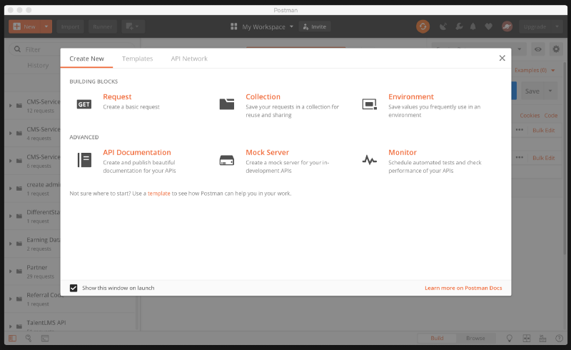

Dependent on the backend developer to start coding? Always being pestered to finish development soon so the frontend developer can start their work? Well, you don't need to wait anymore.

Today, the general office [development](https://hackernoon.com/tagged/development) environment has moved to an open office setup with dependencies between teams, in which development time is of the utmost importance. Anything the team can do to reduce development time is considered a huge advantage towards the development of the product. Recently, I found that using the mock servers provided by Postman is very helpful in helping reduce development time for both frontend and backend developers. So I'll quickly take you into the steps to make a mock server on Postman.

---

### Requirements

1.  Download the [Postman](https://www.getpostman.com/) app from the following link and set up the application.
2.  Create an account on the site.

After installing the application and creating an account you should get a screen like this:

Don’t forget to login to your account on the application after installing it.

### Setting Up a Mock Server

So, click the new button and you get the above screen. Click on mock server and you get the following screen:

](./asset-3.jpeg)

Here, you can create a new [API](https://hackernoon.com/tagged/api) to mock or you can mock an existing collection. If you want to know what collections are, check them out [here](https://www.getpostman.com/docs/v6/postman/collections/intro_to_collections). In the above image you can build your REST API request with its respective HTTP Method. You also get to set your path/endpoint, the response code and the response body for it. You get something like this on completing those steps:

](./asset-4.jpeg)

Click on _Next_ and you then have to name the mock server and set any environment variable if needed. These environmental variables are not important now, so set them to _No Environment._ So now you get something like this:

](./asset-5.jpeg)

Click on _Next_ and your Mock Server is setup. You get a mock URL which links to the mock server built by postman. They always end with _mock.pstmn.io_. You can get the resulting data of your API by hitting that mock URL with the endpoint you made before.

](./asset-6.jpeg)

As soon as you close the above page, you find that a new collection has been created with your respective APIs and an environment variable has also been created with the URL equal to the mock URL of your server.

](./asset-7.jpeg)](./asset-8.jpeg)

On opening the endpoint we created, you need to setup the environment variable as show in the below image. This then setups Postman to accept the URL from the environment variables and that URL has been mapped to the URL of our mock server.

](./asset-9.png)

Now when you click _Send_ you get the below response which is what we had mocked earlier:

](./asset-10.png)

### Congrats! You Have Just Created a Mock Server in Less Than 5 Minutes.

Now, you can manipulate and get your response as a JSON ,set up multiple API endpoints to handle specific responses and errors etc. Do go through the additional material provided below to explore building more sophisticated and better mock servers.

---

### Advantages

1.  Both frontend and backend developers are able to start work without any hassle.
2.  Mock servers are built on an agreed API contract and hence there will only be minor changes in the future for both sets of developers.
3.  Building mock APIs is fast and hence easy for both set of developers to implement.
4.  Reduces development time of both developers as they are not reliant on the other developer to start work.

> Note: In the Postman free account, you are allowed 1000 hit per month on all mock servers. To get more hits, you will need to get a paid account from Postman.

---

### Extra Material

#### Video by Postman Explaining how to Mock Servers:

#### Postman’s Collection of Articles on how you can Mock Servers:

[**Intro to mock servers | _Postman Learning Centre_**  
Postman Learning Centerlearning.getpostman.com](https://learning.getpostman.com/docs/postman/mock_servers/intro_to_mock_servers "https://learning.getpostman.com/docs/postman/mock_servers/intro_to_mock_servers")

---

_I really hope that you find this article useful. I invite you to participate in the discussion in the comments below, I’m always interested to know your thoughts and happy to answer any questions you might have in your mind._

_Thanks for reading! :)_

_P.S Do feel free to connect with me on_ [_LinkedIn_](https://www.linkedin.com/in/rohitjmathew)

