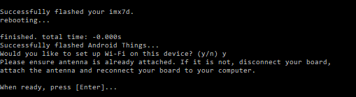

How to build a simple AI assistant based IoT


After getting an Android Things kit at Google Developer Day India, I have been very excited at getting into IoT and building with [Android Things](https://developer.android.com/things/index.html). Here I am finally messing around with it.

---

### Hardware

Some of the supported kits are shown below. I am using the NXP Pico i.MX7D for this article. Raspberry Pi 3 and the Intel Edison are also some of the other supported boards with more manufacturers working to add support.

[**Developer Kits | Android Things**  
_Discover the hardware platforms supported by Android Things as well as developer kits to help you quickly get started…_developer.android.com](https://developer.android.com/things/hardware/index.html "https://developer.android.com/things/hardware/index.html")[](https://developer.android.com/things/hardware/index.html)


---

### Setup

This consists of basically two steps:

-   Connect the hardware components
-   Installing Android Things on the hardware

#### Connect the Hardware

Having max to max fixed a few broken sockets and fixed a few broken stuff at home, building this was very exciting for me.

I followed the [following instructions](https://developer.android.com/things/hardware/imx7d-kit.html) but I only attached the display to the board as I only wanted to mess around with some simple stuff before going into more detailed setups.

[**Pico Pro Maker Kit | Android Things**  
_Connect the parts in the following order. Note that some versions of the Pico Pro Maker Kit do not include the Rainbow…_developer.android.com](https://developer.android.com/things/hardware/imx7d-kit.html "https://developer.android.com/things/hardware/imx7d-kit.html")[](https://developer.android.com/things/hardware/imx7d-kit.html)

I sadly didn’t have a WiFi antenna provided with my kit and had to connect to the internet through an ethernet cable. Also a Rainbow Hat wasn’t provided and hence I decided to make just simple experiments with the kit. Once all the hardware was connected and I powered the kit, it looked like this.


#### Installing Android Things

After the hardware is all connected you have to install Android Things onto the board. I suggest the [Android Things Setup Utility](https://partner.android.com/things/console/u/0/#/tools).


The following guide will help setup the kit. I will also provide a short brief into installing Android Things.

[**NXP i.MX7D | Android Things**  
_The i.MX 7Dual delivers high-performance processing for low-power requirements with a high degree of functional…_developer.android.com](https://developer.android.com/things/hardware/imx7d.html "https://developer.android.com/things/hardware/imx7d.html")[](https://developer.android.com/things/hardware/imx7d.html)

Once you run the executable file, the below are the setups that you encounter.



Once I was done installing Android Things on the board, I didn’t setup the WiFi as I didn’t have an antenna. I hence used an ethernet cable to connect to the internet. Once it was set up my kit looked like this.


---

### Building and Deploying

#### Create a new project

Creating a new Android Things project is very straightforward.

-   Start a new project
-   Select Android Things as the desired form factor
-   In my case, I wanted a UI so I selected “Android Things Empty Activity”
-   Click “Next” and my project was ready


#### Project Configuration

Since the project creation tools set everything up for you, you don’t have to worry about what went on under the hood to work with Android Things. However, I was curious anyways and noticed a few things.

The Android Things dependency was automatically added to the `build.gradle` file.

```
compileOnly 'com.google.android.things:androidthings:+'
```

The manifest had 2 items of interest

-   `<uses-library android:name="com.google.android.things />`
-   an intent filter to handle `IOT_LAUNCHER`


The full explanation for these can be found [here](https://developer.android.com/things/training/first-device/create-studio-project.html). In short, the `IOT_LAUNCHER`category on the intent filter indicates which activity should be launched when run on an IOT device, and the `uses-library` declaration makes the Android Things library available at runtime.

#### Building Hello World

From here, building a Hello World UI application for Android Things was no different than for a phone/tablet once the initial project setup was finished.

I kept this very simple and added a single button that, when tapped, showed a “Hello World” toast.


Once the code was ready, I deployed the project like I would to a phone/tablet and my new app was running on my personally constructed Android Things hardware.

The code can be found on GitHub here:

[**n8ebel/HelloAndroidThings**  
_HelloAndroidThings — Hello World sandbox for discovering Android Things_github.com](https://github.com/n8ebel/HelloAndroidThings "https://github.com/n8ebel/HelloAndroidThings")[](https://github.com/n8ebel/HelloAndroidThings)

---

### Google Assistant Project

I further decided to make a Google Assistant application which is one of the sample projects. For this project you will require:

-   The previous setup
-   Standard mobile earphones which have a microphone

Google does provide a DIY kit which can be used with the raspberry pi to do the same. You should be able to hook up a button, an external microphone and speaker to the kit and use that with the below project to build a smart assistant. I made the following project with the above simple setup and a standard mobile earphone.

[**AIY Projects**  
_We want to put AI into the maker toolkit, to help you solve real problems that matter to you and your communities…_aiyprojects.withgoogle.com](https://aiyprojects.withgoogle.com/ "https://aiyprojects.withgoogle.com/")[](https://aiyprojects.withgoogle.com/)

#### Setup Project to work with Google Assistant API

First clone the following repository onto your device. It has been modified to run for a standard line input/output using a microphone.

[**rohitjmathew/sample-googleassistant**  
_sample-googleassistant - Google Assistant API sample for Android Things_github.com](https://github.com/rohitjmathew/sample-googleassistant "https://github.com/rohitjmathew/sample-googleassistant")[](https://github.com/rohitjmathew/sample-googleassistant)

**Configure Credentials**

Enable the following [activity controls](https://myaccount.google.com/activitycontrols) in the Google Account you plan to use with the Assistant:

-   Web & App Activity

Make sure you check the box that says “Include Chrome browsing history and activity from websites and apps that use Google services”

-   Device Information
-   Voice & Audio Activity

Once done with that:

-   In the Cloud Platform Console, go to the [Projects page](https://console.cloud.google.com/project). Select an existing project or create a new project.
-   Enable the [Google Assistant API](https://console.developers.google.com/apis/api/embeddedassistant.googleapis.com/overview) on the project you selected.
-   Click Enable.
-   [Create an OAuth Client ID](https://console.developers.google.com/apis/credentials/oauthclient)
-   Click Other (select Other UI and User data if prompted) and give the client ID a name.
-   On the OAuth consent screen tab, give the product a name (don’t use _“Google”_ in the name).
-   Click Create. A dialog box appears that shows you a client ID and secret. (No need to remember or save this, just close the dialog.)
-   Click ⬇ (at the far right of screen) for the client ID to download the client secret JSON file (`client_secret_NNNN.json` or `client_id.json`).
-   Open a terminal with python support and install the google-auth-oauthlib. The command is as follows:
-   In your virtual environment, run the command:

```
pip install google-auth-oauthlib[tool]
```

-   Navigate to your top-level project directory.
-   Copy the `client_secret_NNNN.json` file over to your projects root directory, then run Google’s oauthlib tool to generate the credentials.

```
google-oauthlib-tool --client-secrets client_secret_NNNN.json \ --credentials app/src/main/res/raw/credentials.json \ --scope https://www.googleapis.com/auth/assistant-sdk-prototype \ --save
```

-   Now Open the code in android studios. Sync the gradle and then deploy like usual. On the first install permissions have been granted to the application. Restart the application
-   Now the application will run properly. Press the button on the screen and your device will start listening to your voice.

Your voice query gets sent over via the Google Assistant API, and you get a response almost instantaneously. Neat! Since the service is linked to your Google account, you can even tell it to add events to your Calendar and access other information. Ask for a joke, find out tomorrow’s weather, and when you run out of ideas, check out this [comprehensive list](http://www.androidauthority.com/google-home-commands-727911/).

---

### Extra Material

[Dave Smith](https://medium.com/u/c91ac3b63127) has a great, high-level overview of the Android Things platform. This is a wonderful place to start if you have no idea what Android Things is or want to explain it to someone else.


[Rebecca Franks](https://medium.com/u/3f9b9c30bec7) and [Wayne Piekarski](https://medium.com/u/b0d0b1a4ba7) gave some really nice talks at GDD events last year


### Conclusion

I hope this helps people with Android Things supported kits to build a simple Google Assistant application. Again, this has been a lot of fun and it’s great to see how easy it is these days to sprinkle some AI into any project. I still haven’t fully explored the capabilities of my DIY Google Assistant yet, but I think there’s a lot of potential for interesting projects here.

I would also like to extend my sincere gratitude to [Nate Ebel](https://medium.com/u/696aff678e4) and [w4ilun](https://medium.com/u/b5931d74fca5) for their previous works on this topic which helped me get this far.

_I really hope that you find this article useful. I invite you to participate in the discussion in the comments below, I’m always interested to know your thoughts and happy to answer any questions you might have in your mind._

_Thanks for reading! :)_

_P.S Do feel free to connect with me on_ [_LinkedIn_](https://www.linkedin.com/in/rohitjmathew)

<Embed src="undefined" aspectRatio={undefined} caption="" />
